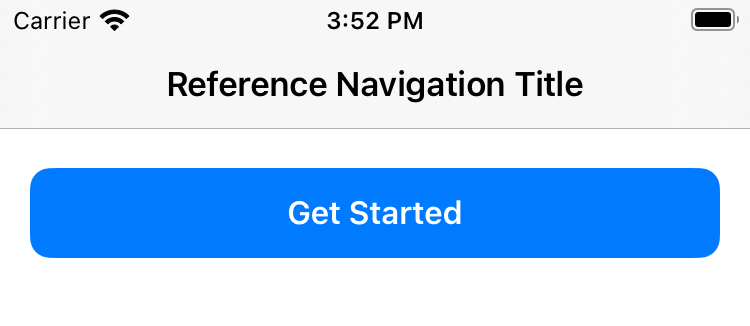
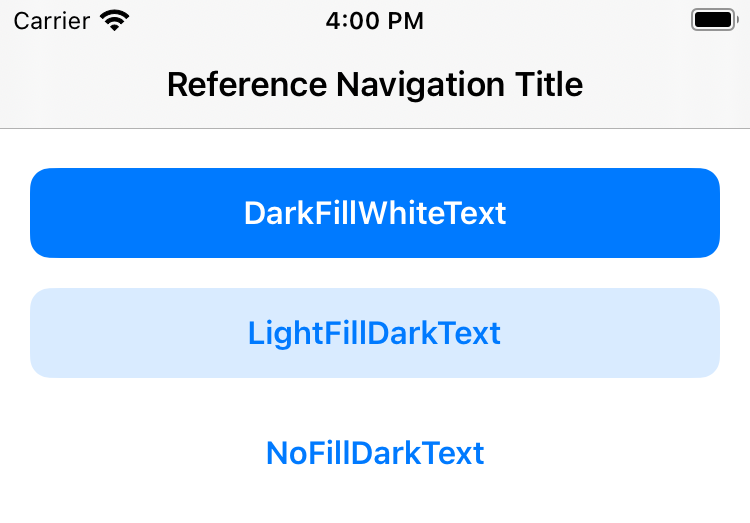

# Button

`Button` is a core component to provide an easy way to interact with your app. It's a `UIButton` subclass that is automatically styled with a provided `ButtonStyle`.

### Features

- Left and right icons,
- responsive text and icons,
- highlight background animation on tap for better UX,
- disabled state,
- easily customizable.

#### Usage

```swift
let button = Button(
  title: "Get Started",
  style: .with(
    colorStyle: .darkFillWhiteText(.system(.blue)),
    cornerRadius: .squircle
  )
)
```



#### Details

To create a `Button` use the default initializer.

```swift
Button.init(
  title: String? = nil,
  image: UIImage? = nil,
  style: ButtonStyle = ButtonStyle.default.fillPrimary
)
```

##### ButtonStyle

Styling a `Button` is done by providing a `ButtonStyle`.

```swift
struct ButtonStyle {
   public enum ImageSide {
        case left
        case right
    }

    let viewStyle: ViewStyle
    let titleStyle: LabelStyle
    let imageSide: ImageSide
    let highlightedColor: UIColor
    let size: UIEdgeInsets

    public init(
        viewStyle: ViewStyle = ViewStyle.colored(.system(.tertiaryFill), cornerRadius: .squircle),
        titleStyle: LabelStyle = .styleWith(font: .button, color: .system(.label)),
        imageSide: ImageSide = .left,
        highlightedColor: UIColor = UIColor.system(.tertiaryFill).shaded(amount: 0.65),
        size: UIEdgeInsets = ButtonSize.default.lg
    ) {
        self.viewStyle = viewStyle
        self.titleStyle = titleStyle
        self.imageSide = imageSide
        self.highlightedColor = highlightedColor
        self.size = size
    }
}
```

Flexign comes with handy factory method to simplify the `ButtonStyle` creation.

```swift
extension ButtonStyle {
  typealias KeyColor = UIColor
  enum ColorStyle {
      case darkFillWhiteText(KeyColor)
      case lightFillDarkText(KeyColor)
      case noFillDarkText(KeyColor)
  }

  static func with(
      size: UIEdgeInsets = ButtonSize.default.md,
      colorStyle: ColorStyle,
      cornerRadius: CornerRadius = .squircle
  ) -> ButtonStyle
```



#### ButtonSize

`ButtonSize` is an enum containing static `UIEdgeInsets` that are applied to the `Button` content. It is a preferred way to size a `Button` over AutoLayout because setting a constant size means the button will not resize itself on text size change.

Flexign comes with following default sizes.

```swift
public enum ButtonSize {
  public enum `default` {
    public static let xs = UIEdgeInsets(top: 8, left: 10, bottom: 8, right: 10)
    public static let sm = UIEdgeInsets(top: 10, left: 10, bottom: 10, right: 10)
    public static let md = UIEdgeInsets(top: 12.5, left: 11, bottom: 12.5, right: 11)
    public static let lg = UIEdgeInsets(top: 15, left: 12.5, bottom: 15, right: 12.5)
  }
}
```
