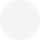

## Color

Flexign comes with a beautfiul color pallette that automatically adapts to the dark mode thanks to usage of system colors.

However, by default system colors are available only for iOS 13.0+ (with few exceptions). Flexign solves this problem by providing a handy way to use the equivalent `rgb` colors when designing for older iOS versions.

#### Usage

```swift
let color = UIColor.system(SystemColor.label)

// Shorter version
let color: UIColor = .system(.label)
```

This will return a system `UIColor` that will automatically adapt to dark mode on iOS 13.0+, or use the light version for devices running older systems.

### Colors list

Below is a list of colors that you can use with the `func system(_ color: Color) -> UIColor`.

- **Name** is the `SystemColor` case name,
- **Color** is the preview image that include the alpha channel,
- **Hex String** is the 8 characters-long hex for this color. The last two characters specify the alpha channel,
- **RGBA** is the ARGB value for this color.

#### Light colors

|                              |                                                                         |            |                                 |
| ---------------------------- | ----------------------------------------------------------------------- | ---------- | ------------------------------- |
| Name                         | Color                                                                   | Hex String | RGBA                            |
| `label`                      |                      | #000000ff  | rgba(0.0, 0.0, 0.0, 1.0)        |
| `secondaryLabel`             |             | #3c3c4399  | rgba(60.0, 60.0, 67.0, 0.6)     |
| `tertiaryLabel`              |              | #3c3c434c  | rgba(60.0, 60.0, 67.0, 0.3)     |
| `quarternaryLabel`           |           | #3c3c432d  | rgba(60.0, 60.0, 67.0, 0.18)    |
| `fill`                       |                       | #78788033  | rgba(120.0, 120.0, 128.0, 0.2)  |
| `secondaryFill`              |              | #78788028  | rgba(120.0, 120.0, 128.0, 0.16) |
| `tertiaryFill`               |               | #7676801e  | rgba(118.0, 118.0, 128.0, 0.12) |
| `quarternaryFill`            |            | #74748014  | rgba(116.0, 116.0, 128.0, 0.08) |
| `background`                 |                 | #ffffffff  | rgba(255.0, 255.0, 255.0, 1.0)  |
| `secondaryBackground`        |        | #f2f2f7ff  | rgba(242.0, 242.0, 247.0, 1.0)  |
| `tertiaryBackground`         |         | #ffffffff  | rgba(255.0, 255.0, 255.0, 1.0)  |
| `groupedBackground`          |          | #f2f2f7ff  | rgba(242.0, 242.0, 247.0, 1.0)  |
| `secondaryGroupedBackground` |           | #ffffffff  | rgba(255.0, 255.0, 255.0, 1.0)  |
| `tertiaryGroupedBackground`  |  | #f2f2f7ff  | rgba(242.0, 242.0, 247.0, 1.0)  |
| `separator`                  |                  | #3c3c4349  | rgba(60.0, 60.0, 67.0, 0.29)    |
| `opaqueSeparator`            |            | #c6c6c8ff  | rgba(198.0, 198.0, 200.0, 1.0)  |
| `blue`                       |                       | #007affff  | rgba(0.0, 122.0, 255.0, 1.0)    |
| `green`                      |                | #34c759ff  | rgba(52.0, 199.0, 89.0, 1.0)    |
| `indigo`                     |               | #5856d6ff  | rgba(88.0, 86.0, 214.0, 1.0)    |
| `orange`                     |               | #ff9500ff  | rgba(255.0, 149.0, 0.0, 1.0)    |
| `pink`                       |                 | #ff2d55ff  | rgba(255.0, 45.0, 85.0, 1.0)    |
| `purple`                     |               | #af52deff  | rgba(175.0, 82.0, 222.0, 1.0)   |
| `red`                        |                  | #ff3b30ff  | rgba(255.0, 59.0, 48.0, 1.0)    |
| `teal`                       |                 | #5ac8faff  | rgba(90.0, 200.0, 250.0, 1.0)   |
| `yellow`                     |               | #ffcc00ff  | rgba(255.0, 204.0, 0.0, 1.0)    |
| `gray`                       |                 | #8e8e93ff  | rgba(142.0, 142.0, 147.0, 1.0)  |
| `gray2`                      |                | #aeaeb2ff  | rgba(174.0, 174.0, 178.0, 1.0)  |
| `gray3`                      |                | #c7c7ccff  | rgba(199.0, 199.0, 204.0, 1.0)  |
| `gray4`                      |                | #d1d1d6ff  | rgba(209.0, 209.0, 214.0, 1.0)  |
| `gray5`                      |                | #e5e5eaff  | rgba(229.0, 229.0, 234.0, 1.0)  |
| `gray6`                      |                | #f2f2f7ff  | rgba(242.0, 242.0, 247.0, 1.0)  |

#### Dark colors

|                              |                                                                        |            |                                 |
| ---------------------------- | ---------------------------------------------------------------------- | ---------- | ------------------------------- |
| Name                         | Color                                                                  | Hex String | RGBA                            |
| `label`                      |                | #ffffffff  | rgba(255.0, 255.0, 255.0, 1.0)  |
| `secondaryLabel`             |       | #ebebf599  | rgba(235.0, 235.0, 245.0, 0.6)  |
| `tertiaryLabel`              |        | #ebebf54c  | rgba(235.0, 235.0, 245.0, 0.3)  |
| `quaternaryLabel`            |     | #ebebf52d  | rgba(235.0, 235.0, 245.0, 0.18) |
| `fill`                       |                 | #7878805b  | rgba(120.0, 120.0, 128.0, 0.36) |
| `secondaryFill`              |        | #78788051  | rgba(120.0, 120.0, 128.0, 0.32) |
| `tertiaryFill`               |         | #7676803d  | rgba(118.0, 118.0, 128.0, 0.24) |
| `quaternaryFill`             |      | #7676802d  | rgba(118.0, 118.0, 128.0, 0.18) |
| `background`                 |           | #000000ff  | rgba(0.0, 0.0, 0.0, 1.0)        |
| `secondaryBackground`        |  | #1c1c1eff  | rgba(28.0, 28.0, 30.0, 1.0)     |
| `tertiaryBackground`         |   | #2c2c2eff  | rgba(44.0, 44.0, 46.0, 1.0)     |
| `groupedBackground`          |    | #000000ff  | rgba(0.0, 0.0, 0.0, 1.0)        |
| `secondaryGroupedBackground` |     | #1c1c1eff  | rgba(28.0, 28.0, 30.0, 1.0)     |
| `tertiaryGroupedBackground`  |      | #2c2c2eff  | rgba(44.0, 44.0, 46.0, 1.0)     |
| `separator`                  |            | #54545899  | rgba(84.0, 84.0, 88.0, 0.6)     |
| `opaqueSeparator`            |      | #38383aff  | rgba(56.0, 56.0, 58.0, 1.0)     |
| `blue`                       |                 | #0a84ffff  | rgba(10.0, 132.0, 255.0, 1.0)   |
| `green`                      |          | #30d158ff  | rgba(48.0, 209.0, 88.0, 1.0)    |
| `indigo`                     |         | #5e5ce6ff  | rgba(94.0, 92.0, 230.0, 1.0)    |
| `orange`                     |         | #ff9f0aff  | rgba(255.0, 159.0, 10.0, 1.0)   |
| `pink`                       |           | #ff375fff  | rgba(255.0, 55.0, 95.0, 1.0)    |
| `purple`                     |         | #bf5af2ff  | rgba(191.0, 90.0, 242.0, 1.0)   |
| `red`                        |            | #ff453aff  | rgba(255.0, 69.0, 58.0, 1.0)    |
| `teal`                       |           | #64d2ffff  | rgba(100.0, 210.0, 255.0, 1.0)  |
| `yellow`                     |         | #ffd60aff  | rgba(255.0, 214.0, 10.0, 1.0)   |
| `gray`                       |           | #8e8e93ff  | rgba(142.0, 142.0, 147.0, 1.0)  |
| `gray2`                      |          | #636366ff  | rgba(99.0, 99.0, 102.0, 1.0)    |
| `gray3`                      |          | #48484aff  | rgba(72.0, 72.0, 74.0, 1.0)     |
| `gray4`                      |          | #3a3a3cff  | rgba(58.0, 58.0, 60.0, 1.0)     |
| `gray5`                      |          | #2c2c2eff  | rgba(44.0, 44.0, 46.0, 1.0)     |
| `gray6`                      |          | #1c1c1eff  | rgba(28.0, 28.0, 30.0, 1.0)     |

## Extending

Every design system comes with a unique color pallette that defines the brand. For example, [Atlassian](https://atlassian.design/foundations/color/) uses a _Pacific bridge_ color as their primary brand color (`#0052CC`).

Consider picking a few key colors that define your brand and encapsulating them in a `enum`.

```swift
enum MyAppColor {
  static let pacificBridge = UIColor(hex: "#0052CC")
  static let poppySunrise = UIColor(hex: "#FF5630")
  static let finePine = UIColor(hex: "#36B37E")
}
```

Alternatively, you can extend the `UIColor` class and provide class computed properties for better autocompletion.

```swift
extension UIColor {
  class var pacificBridge: UIColor {
    UIColor(hex: "#0052CC")
  }
  class var poppySunrise: UIColor {
    UIColor(hex: "#FF5630")
  }
  class var finePine: UIColor {
    UIColor(hex: "#36B37E")
  }
}
```

Flexign comes with a handy `convenience init` for the `UIColor`.

```swift
extension UIColor {
    convenience init?(hex: String) {
      ...
    }
}
```

By doing so now you can create colors like this.

```swift
let color: UIColor = .finePine
```

#### Accessibility and Dark Mode

When using custom colors you should make sure that the colors are accessible, color blind friendly and adaptive to the Dark Mode.

Consider using as many system colors as possible to ensure a pleasant and accessible experience for your users. They are fully optimised for color blindness, enhanced contrast and will adapt to the light level and interface appearance.

Read more about [accessiblity](https://developer.apple.com/design/human-interface-guidelines/accessibility/overview/color-and-contrast/) and [Color](https://developer.apple.com/design/human-interface-guidelines/ios/visual-design/color/)
