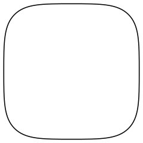

# CornerRadius

Flexign makes it easy to create beautiful and consistent rounded corners that make your designs stand out.

#### Usage

```swift
let view = UIView()
view.applyCornerRadius(.rounded(CornerRadiusSize.large))
...
view.applyCornerRadius(.squircle)
...
view.applyCornerRadius(.full)
...
view.applyCornerRadius(.none)
```

### Default values

The default corner radius styles and values that ship with Flexign are listed below.

##### CornerRadius

```swift
enum CornerRadius {
    case none
    case full
    case rounded(CGFloat)
    case squircle
}
```

- `none` applies no `cornerRadius` of 0,
- `full` applies `cornerRadius` equal to the `height / 2` of the view,
- `rounded(x)` applies `cornerRadius` equal to `x`,
- `squircle` is a special type of corner radius. It's ofted used in the Apple ecosystem, and looks like this:

  

You can read more about this shape on [_Wikipedia_](https://en.wikipedia.org/wiki/Squircle).

##### CornerRadiusSize

```swift
enum CornerRadiusSize {
    static let large: CGFloat = 12
    static let base: CGFloat = 6
    static let small: CGFloat = 4
}

```
