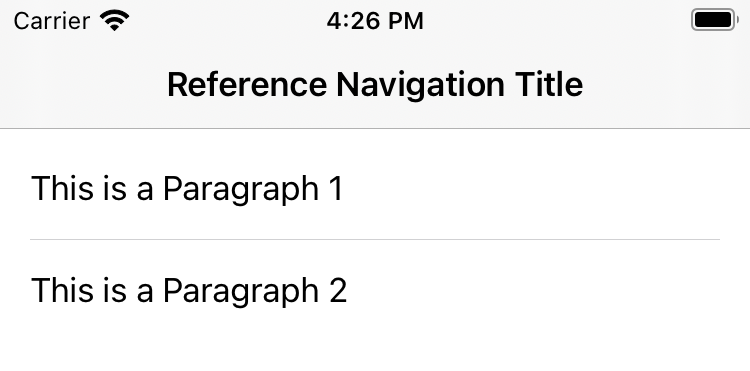

# Separator

`Separator` is a grey line that serves as a divider between sections in your app. It improves readability and allows for better segmentation of the content.

#### Usage

```swift
//from quick example
let separator = Separator()
```



#### Details

To create a `Separator` use the default initializer.

```swift
Separator.init(style: SeparatorStyle = SeparatorStyle())
```

##### SeparatorStyle

Styling a `Separator` is done by providing a `SeparatorStyle`.

```swift
struct SeparatorStyle {
  let backgroundColor: UIColor

  init(
    backgroundColor: UIColor = UIColor.system(.opaqueSeparator)
  ) {
    self.backgroundColor = backgroundColor
  }
}
```
