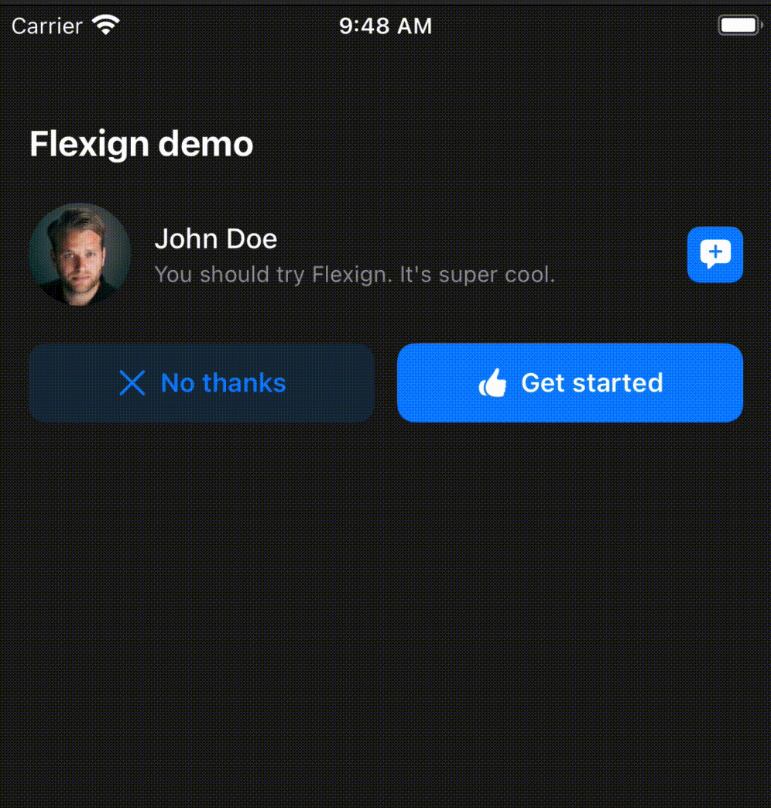

# Typography

Flexign comes with a set of hand-crafted fonts for every use case you might encounter.

Under the hood it uses the `UIFont.TextStyle` instead of the plain `systemFont(ofSize fontSize: CGFloat)`. This ensures you get a consistent and accessible typography set out-the-box.

#### Usage

```swift
let font = UIColor.headline

// alternatively
let font: UIColor = .headline
```

This will return a `UIFont` with the `TextStyle.headline` and `.medium` weight. Any element that uses this font will now adjust the font size according to the user's settings.

### Accessibility responsiveness example

<details>
  <summary>Click to expand!</summary>
  
</details>

### Fonts list

Below is a list of all fonts that ships

- **Name** is the `Color` case name,
- **Color** is the preview image that include the alpha channel,
- **Hex String** is the 8 characters-long hex for this color. The last two characters specify the alpha channel,
- **RGBA** is the ARGB value for this color.

#### Light colors

## Extending

Every design system comes with a unique color pallette that defines the brand. For example, [Atlassian](https://atlassian.design/foundations/color/) uses a _Pacific bridge_ color as their primary brand color (`#0052CC`).

Consider picking a few key colors that define your brand and encapsulating them in a `enum`.

```swift
enum MyAppColor {
  static let pacificBridge = UIColor(hex: "#0052CC")
  static let poppySunrise = UIColor(hex: "#FF5630")
  static let finePine = UIColor(hex: "#36B37E")
}
```

Alternatively, you can extend the `UIColor` class and provide class computed properties for better autocompletion.

```swift
extension UIColor {
  class var pacificBridge: UIColor {
    UIColor(hex: "#0052CC")
  }
  class var poppySunrise: UIColor {
    UIColor(hex: "#FF5630")
  }
  class var finePine: UIColor {
    UIColor(hex: "#36B37E")
  }
}
```

Flexign comes with a handy `convenience init` for the `UIColor`.

```swift
extension UIColor {
    convenience init?(hex: String) {
      ...
    }
}
```

By doing so now you can create colors like this.

```swift
let color: UIColor = .finePine
```

#### Accessibility and Dark Mode

When using custom colors you should make sure that the colors are accessible, color blind friendly and adaptive to the Dark Mode.

Consider using as many system colors as possible to ensure a pleasant and accessible experience for your users. They are fully optimised for color blindness, enhanced contrast and will adapt to the light level and interface appearance.

Read more about [accessiblity](https://developer.apple.com/design/human-interface-guidelines/accessibility/overview/color-and-contrast/) and [Color](https://developer.apple.com/design/human-interface-guidelines/ios/visual-design/color/)
