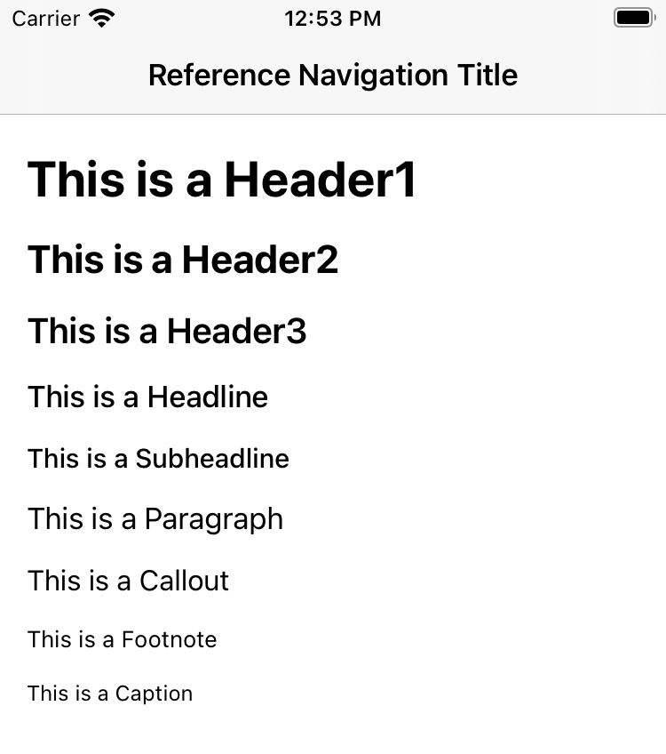
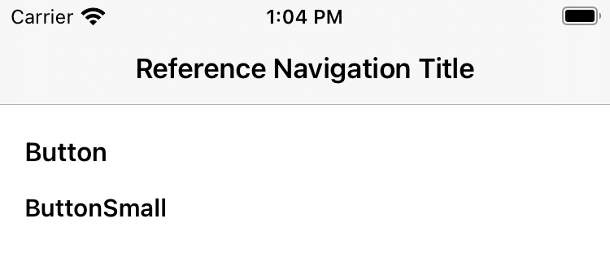

# Typography

Flexign comes with a set of hand-crafted fonts for every use case you might encounter.

Under the hood it uses the `UIFont.TextStyle` instead of the plain `systemFont(ofSize fontSize: CGFloat)`. This ensures you get a consistent and accessible typography set out-the-box.

#### Usage

```swift
let font = UIColor.headline

// alternatively
let font: UIColor = .headline
```

This will return a `UIFont` with the `TextStyle.headline` and `.medium` weight. Any element that uses this font will now adjust the font size according to the user's settings.

### Accessibility responsiveness example

<details>
  <summary>Click to expand!</summary>
  
</details>

### Default typography

The default typography set that ships with Flexign is listed below.
Here's a screenshot of an iPhone 8 with the default font size.



Pseudocode declarations in a `UIFont.TextStyle, UIFont.Weight` format.

```swift
let header1 = .title1, .bold
let header2 = .title2, .bold
let header3 = .title3, .semibold
let headline = .headline, .medium
let subheadline = .subheadline, .medium
let paragraph = .body, .regular
let callout = .callout, .regular
let footnote = .footnote, .regular
let caption = .caption1, .regular
```

#### Button typography

There are additional two fonts created with buttons in mind.



```swift
let button = .callout, .semibold
let buttonSm = .subheadline, .semibold
```

## Extending

Flexign comes with a handy factory method that lets you mix and match different font styles and weights.

```swift
UIFont.preferredFont(for style: TextStyle, weight: Weight) -> UIFont
```

This way you can create your own custom fonts and keep the full accessibility support that comes with Apple's `UIFont.TextStyle`

Consider using system font family instead of a custom one:

> Apple-designed typefaces support an extensive range of weights, sizes, styles, and languages, so you can design comfortable and beautiful reading experiences throughout your app. When you use text styles with the system fonts, you also get support for Dynamic Type and the larger accessibility type sizes, which let people choose the text size that works for them.

_From [Apple Human Interface Guidelines](https://developer.apple.com/design/human-interface-guidelines/ios/visual-design/typography/)._

The easiest way to define your own font is extending `UIFont` with `class var` for a quick access.

```swift
public extension UIFont {
    class var myCustomFont1: UIFont {
      UIFont.preferredFont(for: .title1, weight: .semibold)
    }
    class var myCustomFont2: UIFont {
      UIFont.preferredFont(for: .footnote, weight: .medium)
    }
}

...

let font = UIFont.myCustomFont1
```
